# 15 — Examples: What We Are Building

Before reading architecture or writing Java, skim these examples. Each file is a **real-world scenario** (support, on-call, marketplace, legal, finance)—not a toy prompt—scoped to [Vision & Goals](./01-vision-and-goals.md).

Runnable YAML: [`examples/`](../examples/). Goal mapping: [`examples/GOALS.md`](../examples/GOALS.md).

---

## Aligned with project goals (not random demos)

| Goal | Examples that prove it |
|------|-------------------------|
| G1 Simplicity | `01` — copilot in ~15 lines of tasks |
| G2 Reliability | `05`, `10` — retry, fallback, `onFailure` |
| G3 Observability | `08`, `09`, `11`, `13` — cost metrics + live SSE token stream |
| G4 Extensibility | `09`, `14` — HTTP/DB plugins; `14` exposes them as LLM tools |
| G5 Performance | `03`, `10`, `16` — `core.parallel` + worker pool; `15` — `core.foreach` |
| G6 Agent logic, not plumbing | `14` — model picks tools; platform runs the loop |

**Out of scope (no examples for these):** custom training, built-in vector DB, drag-and-drop UI. RAG appears only in `09` as HTTP to **your** index.

---

## How to read an example

Every example file follows the same mental model:

| Piece | Role |
|-------|------|
| `id` + `namespace` | Identity and folder (like `production.marketing`) |
| `inputs` | Values passed when someone (or a webhook) starts a run |
| `variables` | Fixed config inside the flow (models, thresholds) |
| `tasks` | Ordered steps; each `type` is a plugin (`openai.chat`, `core.if`, …) |
| `{{ outputs.<taskId>... }}` | Wire one step's result into the next |
| `onFailure` | Optional cleanup when the run fails |

**Flow** = recipe (YAML file). **Execution** = one run of that recipe. **TaskRun** = one step inside that run. See [Terminology](./02-terminology.md).

---

## Example catalog

### 1. Release Notes Copilot — start here

**File:** [`examples/01-hello-agent.yaml`](../examples/01-hello-agent.yaml) (`id: release-notes-copilot`)

**Scenario:** In-app product copilot answers questions using **only** the release notes passed at runtime (MVP smoke test).

**Goals:** G1, G6.

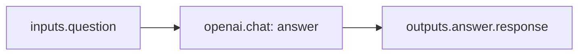

**Features:** inputs, variables, single plugin, expressions.

**Use when:** Validating the parser, worker, and OpenAI plugin end-to-end.

---

### 2. Competitive Intel Briefing — sequential chain

**File:** [`examples/02-research-and-summarize.yaml`](../examples/02-research-and-summarize.yaml) (`id: competitive-intel-briefing`)

**Scenario:** Product marketing analyzes a competitor announcement; Claude writes a 150-word CPO brief from GPT analysis.

**Goals:** Connected agents, multi-LLM, cost labels (`production.product-marketing`).

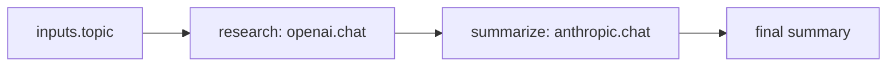

**Features:** multi-LLM pipeline, `outputs.*` chaining, cross-provider agents.

**Use when:** "Agent A → Agent B" is the core product story—connected agents, not isolated scripts.

---

### 3. Marketplace Listing Moderation — parallel + branch

**File:** [`examples/03-content-moderation.yaml`](../examples/03-content-moderation.yaml) (`id: listing-moderation`)

**Scenario:** Trust & safety normalizes a seller listing, runs toxicity + policy checks **in parallel**, publishes or rejects by `listingId`.

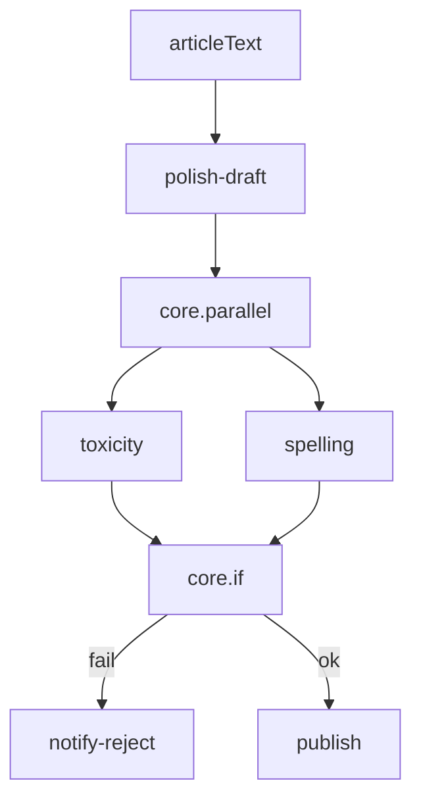

**Features:** `core.parallel`, nested outputs (`outputs.safety-checks.toxicity.*`), `core.if`, `onFailure`, HTTP side effects.

**Use when:** Latency matters—you can check multiple signals without waiting for each sequentially.

---

### 4. Helpdesk Ticket Router — webhook + classify

**File:** [`examples/04-support-ticket-router.yaml`](../examples/04-support-ticket-router.yaml)

**Scenario:** Zendesk/Intercom webhook starts the flow; billing vs technical vs general agent drafts a reply into the ticket.

**Goals:** P1 webhook trigger, router pattern, G6.

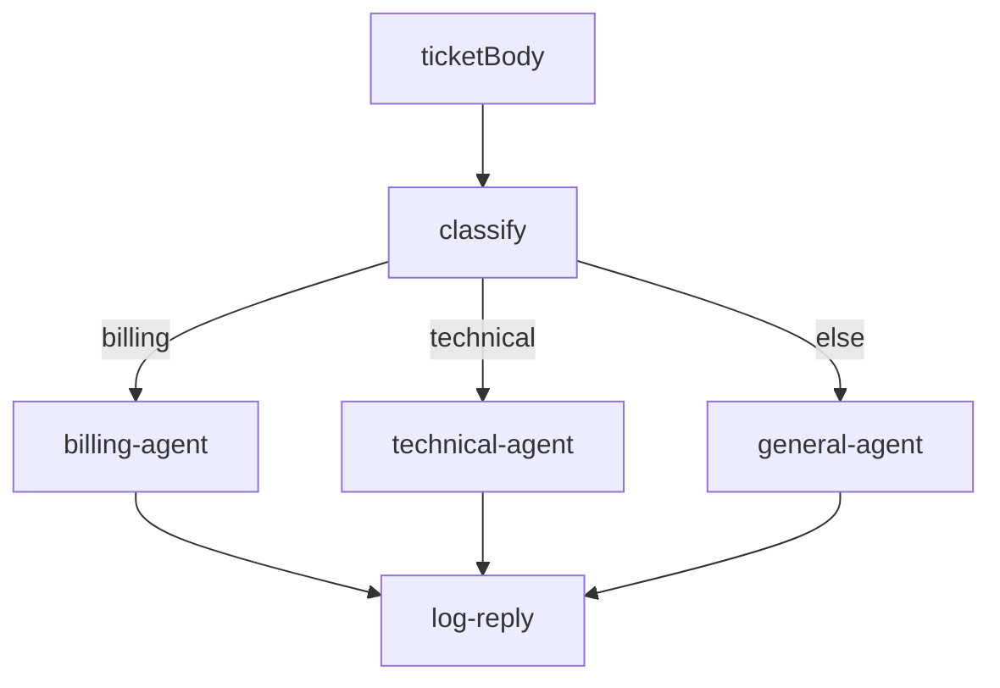

**Features:** router pattern, conditional trees, CRM integration stub.

**Use when:** One ingress path (webhook/API) must fan out to different prompt specialists.

---

### 5. Invoice Line Extraction — resilience

**File:** [`examples/05-model-fallback.yaml`](../examples/05-model-fallback.yaml) (`id: invoice-line-item-extraction`)

**Scenario:** Finance AP parses vendor invoice text to JSON and posts to ERP; Claude fallback if OpenAI rate-limits.

**Features:** `fallback`, `fallbackOn`, retries, timeouts.

**Use when:** Production flows cannot fail outright because one vendor blipped.

---

### 6. Regulated Email Campaign — human-in-the-loop

**File:** [`examples/06-human-approval.yaml`](../examples/06-human-approval.yaml) (`id: regulated-email-campaign`)

**Scenario:** Healthcare/life-sciences marketing draft; compliance must approve before SendGrid send.

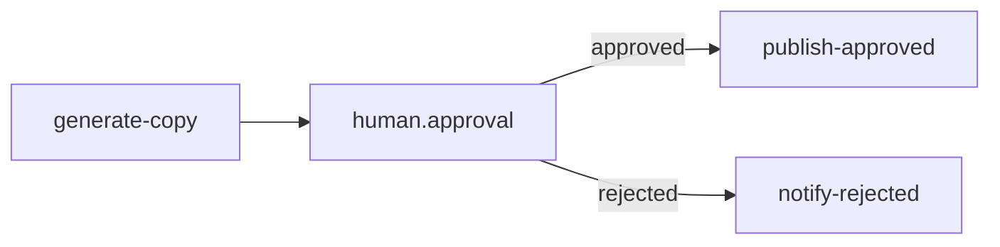

**Features:** `human.approval`, `if` on approval output, `PAUSED` execution state (see [AI Agents](./09-ai-agents.md)).

**Use when:** Legal, marketing, or compliance must sign off before side effects.

---

### 7. Interview Screening Assistant — shared context

**File:** [`examples/07-shared-context.yaml`](../examples/07-shared-context.yaml) (`id: interview-screening-assistant`)

**Scenario:** HR ATS plugin—screening bot asks questions; coach model suggests follow-ups in the **same** `contextKey` thread.

**Features:** shared memory within an execution, multi-model handoff.

**Use when:** Follow-up agents need thread history, not only the last message body.

**Note:** Long-term RAG still uses **your** vector DB via HTTP or custom plugins—not a built-in vector store. See [Vision — Out of Scope](./01-vision-and-goals.md#what-we-are-not-building-out-of-scope).

---

### 8. Cost Tracking — tokens and USD per step and per run

**File:** [`examples/08-cost-tracking.yaml`](../examples/08-cost-tracking.yaml)

Three LLM tasks in one flow (draft → refine → shorten). Each step automatically records token usage and estimated USD cost; the engine aggregates totals on the execution record.

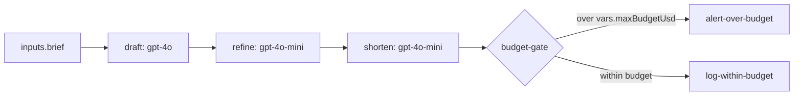

**You do not configure cost tracking in YAML** — AI plugins return metrics on every TaskRun. Use YAML to:

| Mechanism | Purpose |
|-----------|---------|
| `labels` on the flow | Filter costs in `GET /metrics/costs` (team, cost-center, environment) |
| `variables.maxBudgetUsd` | Threshold for a post-run `core.if` budget gate |
| `{{ outputs.<taskId>.costUsd }}` | Branch or alert using a prior step's cost |
| `{{ outputs.<taskId>.tokensUsed }}` | Log or route based on token volume |
| `maxTokens` on a task | Cap completion size (indirect cost control) |

**Per-task output** (stored on `task_runs`, exposed as `outputs.<taskId>.*`):

See [`examples/sample-output/ai-task-run-output.json`](../examples/sample-output/ai-task-run-output.json).

```json
{
  "response": "...",
  "model": "gpt-4o",
  "tokensUsed": 1523,
  "promptTokens": 245,
  "completionTokens": 1278,
  "costUsd": 0.04569
}
```

**Per-execution rollup** (PostgreSQL `executions.total_cost_usd`, `total_tokens`; SSE `execution_completed`):

See [`examples/sample-output/execution-completed-sse.json`](../examples/sample-output/execution-completed-sse.json).

**Observability surfaces:**

| Surface | What you get |
|---------|----------------|
| Dashboard / TaskRun detail | Inputs, outputs, duration, `tokens_used`, `cost_usd` per task |
| `GET /executions/{id}` | Run summary including `totalCostUsd` |
| `GET /metrics/costs` | Breakdown by flow and by model |
| SSE `GET /executions/{id}/logs/stream` | `execution_completed` event with `totalCostUsd` |

**Features:** F3.3 token tracking, F3.4 cost calculation, F4.4 cost dashboard (P1), flow `labels` for attribution.

**Use when:** Finance or platform teams need per-flow LLM spend, or you want alerts when a single run exceeds a budget.

**Related:** [AI Agents — Cost & Token Tracking](./09-ai-agents.md#cost--token-tracking), [API — GET /metrics/costs](./10-api-design.md#get-metricscosts), [Data Models](./06-data-models.md).

---

### 9. RAG Customer Support — external vector DB

**File:** [`examples/09-rag-customer-support.yaml`](../examples/09-rag-customer-support.yaml)

**Scenario:** B2B billing SaaS Tier-2: embed question → query **Pinecone** → answer with citations → log to CRM.

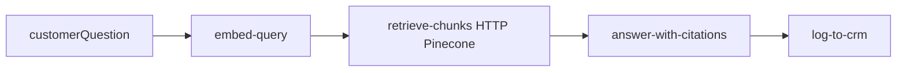

**Goals:** G4 extensibility, G6 (orchestration only—**not** hosting vectors). Aligns with value prop #7 (RAG via external store).

---

### 10. Incident Triage — on-call webhook

**File:** [`examples/10-incident-triage.yaml`](../examples/10-incident-triage.yaml)

**Scenario:** PagerDuty/Datadog POSTs an alert; classify severity, fetch runbook + draft Slack update **in parallel**, page on-call or open Jira.

**Goals:** G2, G5, webhook trigger, `onFailure` escalation.

---

### 11. Weekly Ops Digest — cron + leadership report

**File:** [`examples/11-weekly-ops-digest.yaml`](../examples/11-weekly-ops-digest.yaml)

**Scenario:** Every Monday 8am ET: pull Datadog SLO + PagerDuty incidents, Claude writes VP digest, email with `costUsd` in metadata.

**Goals:** G3 observability, cron trigger (P1), cost attribution labels.

---

### 12. Vendor Contract Review — legal HITL

**File:** [`examples/12-contract-review-hitl.yaml`](../examples/12-contract-review-hitl.yaml)

**Scenario:** Extract MSA clauses → liability score 1–10 → if ≥ threshold, legal/finance approves before CLM archive; else auto-approve low risk.

**Goals:** HITL (P2), connected agents, production `legal` namespace.

---

### 13. Streaming Product Copilot — SSE token stream

**File:** [`examples/13-streaming-copilot.yaml`](../examples/13-streaming-copilot.yaml)

**Scenario:** In-app chat widget: user sees the answer **token-by-token** while the flow runs; when streaming ends, a second task persists the full transcript + usage to your API.

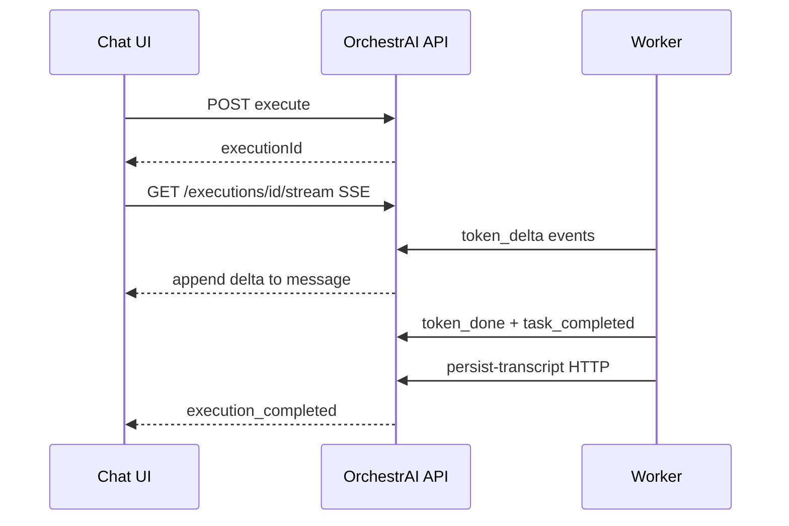

**YAML:**

```yaml
- id: stream-answer
  type: openai.chat
  stream: true
  prompt: "{{ inputs.userMessage }}"
```

**Client:** `GET /v1/executions/{executionId}/stream` — handle `token_delta` and `token_done`. Not the same as `/logs/stream` (ops logs only).

| SSE event | Purpose |
|-----------|---------|
| `token_delta` | Append `delta` to the chat bubble |
| `token_done` | Final text + `tokensUsed` + `costUsd` |
| `execution_completed` | Close `EventSource` |

**Samples:** [`token-stream-sse.txt`](../examples/sample-output/token-stream-sse.txt), [`streaming-client.md`](../examples/sample-output/streaming-client.md).

**Goals:** G3 observability, F3.9 streaming, G6 (no custom WebSocket server in app code).

**Related:** [AI Agents — Streaming](./09-ai-agents.md#5-streaming), [API — Token streaming](./10-api-design.md#token-streaming-sse).

---

### 14. Sales Rep Copilot — tool calling

**File:** [`examples/14-sales-agent-with-tools.yaml`](../examples/14-sales-agent-with-tools.yaml)

**Scenario:** Rep asks: *"What does Acme owe us and schedule a follow-up?"* One `openai.chat` task exposes CRM/ERP tools; the **model** picks `lookup_account`, `list_open_invoices`, and `create_followup_task` with generated arguments—not a fixed task order.

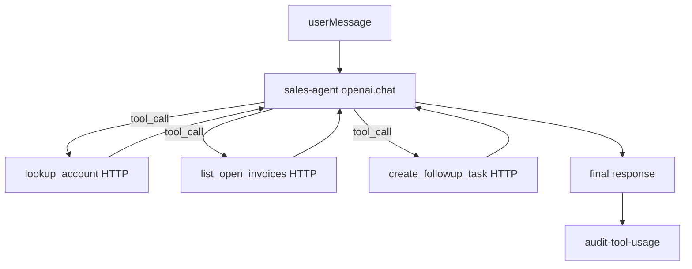

| Concept | Fixed pipeline (`02`, `09`) | Tool calling (`14`) |
|---------|----------------------------|---------------------|
| Task order | Defined in YAML | Chosen by the model |
| Arguments | `inputs` / `outputs` | `tool.args` from model |
| Integrations | Always run | Run only if needed |

**Key YAML:**

```yaml
tools:
  - name: lookup_account
    parameters: { type: object, required: [accountId], properties: { ... } }
    type: http.request
    url: "https://crm.example.com/v1/accounts/{{ tool.args.accountId }}"
```

**Output:** `outputs.sales-agent.toolCalls` for audit dashboards. Sample: [`tool-calling-roundtrip.json`](../examples/sample-output/tool-calling-roundtrip.json).

**Goals:** F3.7, G4 (HTTP/DB plugins as tools), G6.

**Related:** [AI Agents — Tool calling](./09-ai-agents.md#tool-calling--llm-invoked-subtasks), [YAML Schema — tools](./04-yaml-schema.md#tool-definitions-tools-on-ai-chat-tasks).

---

### 15. Churn Save Outreach — `core.foreach`

**File:** [`examples/15-churn-outreach-foreach.yaml`](../examples/15-churn-outreach-foreach.yaml)

**Scenario:** Customer success pulls today's at-risk accounts from analytics, then **loops** each account: draft a personalized save email with GPT and log a CRM activity—without writing 50 copies of the same task in YAML.

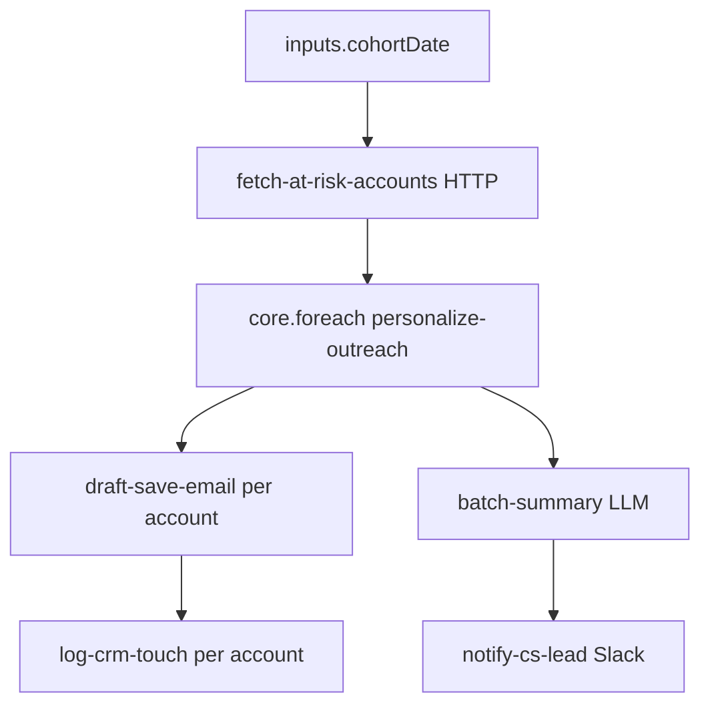

**Inside the loop:**

```yaml
- id: personalize-outreach
  type: core.foreach
  items: "{{ outputs.fetch-at-risk-accounts.body.accounts }}"
  tasks:
    - id: draft-save-email
      type: openai.chat
      prompt: "Company {{ taskrun.value.companyName }} — {{ taskrun.index + 1 }}/{{ taskrun.total }}"
```

| Expression | Use |
|------------|-----|
| `taskrun.value` | Current account object from the list |
| `taskrun.index` / `taskrun.total` | Progress in prompts or logs |
| `outputs.personalize-outreach.results` | All iterations (after loop) |
| `outputs.personalize-outreach.count` | Batch size for summary step |

**vs `core.parallel`:** Parallel runs branches **once** at the same time; foreach runs the **same** nested tasks for **each list item** (serial or worker-scaled per config).

**Goals:** F2.4 loops, G6 (batch agent + HTTP without app orchestration code).

**Sample:** [`foreach-results.json`](../examples/sample-output/foreach-results.json).

**Related:** [YAML Schema — foreach](./04-yaml-schema.md#3-loop-task-coreforeach), [Execution Engine](./07-execution-engine.md#coreforeach-batch-iterations).

---

### 16. Distributed Contract Review — Kafka multi-worker

**File:** [`examples/16-distributed-document-review.yaml`](../examples/16-distributed-document-review.yaml)

**Scenario:** Legal team scores **four contracts in parallel**—each review is a separate `task-runs` Kafka message; any idle worker in the pool can pick it up. After all four `task-results` arrive, the Executor runs `compliance-summary` on a single path (not parallelized).

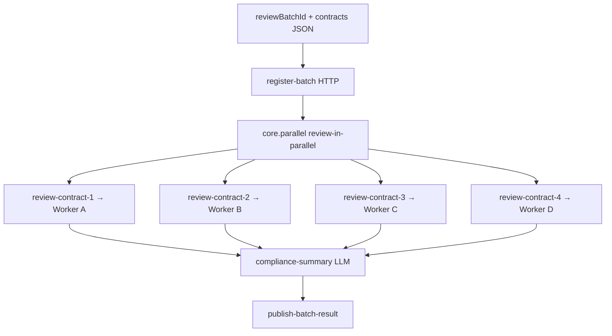

**You do not configure Kafka in the flow** — topics and consumer groups are platform infrastructure. You **do** choose patterns that fan out work:

| Pattern | Worker messages per execution |
|---------|------------------------------|
| `core.parallel` (4 children) | 4 simultaneous `task-runs` |
| `core.foreach` (N items) | N iteration task-runs |
| Sequential chain | 1 at a time per path |

**Deep dive:** [`examples/DISTRIBUTED.md`](../examples/DISTRIBUTED.md) — topic table, replica scaling, sample [`kafka-task-run-message.json`](../examples/sample-output/kafka-task-run-message.json).

**Goals:** F2.8 distributed execution, G5 performance, Goal 5 (1000+ concurrent workflows at platform level).

**Related:** [Architecture](./05-architecture.md), [Execution Engine — parallel](./07-execution-engine.md#parallel-execution-stateless-wait).

---

### 17. Order Fulfillment — Kafka event trigger

**File:** [`examples/17-order-fulfillment-kafka-trigger.yaml`](../examples/17-order-fulfillment-kafka-trigger.yaml)

**Scenario:** Storefront publishes `ecommerce.orders.created` → OrchestrAI consumes → one execution per order: OMS validate → LLM packing note → WMS shipment create (or Slack alert if invalid).

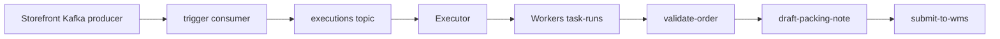

**Trigger YAML:**

```yaml
triggers:
  - id: on-order-created
    type: kafka
    topic: ecommerce.orders.created
    consumerGroup: orchestrai-fulfillment-v1
```

| Trigger type | Starts execution when | Example |
|--------------|----------------------|---------|
| `kafka` | Message on **your** topic | `17` |
| `webhook` | HTTP POST to OrchestrAI | `04`, `10` |
| `schedule.cron` | Cron fires | `11` |
| Manual | `POST .../execute` | Any flow |

**Payload → inputs:** Kafka `value` fields match `inputs.orderId`, `inputs.lineItems`, etc. Sample: [`kafka-trigger-message.json`](../examples/sample-output/kafka-trigger-message.json).

**vs internal Kafka:** `task-runs` / `task-results` are platform queues inside a run. Trigger Kafka is **ingress** from your product.

**Goals:** F5.4, G6 (no bespoke consumer microservice), value prop #8 triggers.

**Related:** [YAML Schema — Kafka trigger](./04-yaml-schema.md#kafka-event-kafka--starts-flow-on-message), [API — Triggers](./10-api-design.md#triggers-kafka-webhook-cron), [DISTRIBUTED.md](../examples/DISTRIBUTED.md#kafka-event-trigger-starts-a-new-execution).

---

## Map examples to MVP features

| Example | Scenario | MVP / priority | Goals |
|---------|----------|----------------|-------|
| 01 Release notes copilot | In-app Q&A | P0 | G1, G6 |
| 02 Competitive intel | PMM → CPO brief | P0 | Pipeline, multi-LLM |
| 03 Listing moderation | Marketplace trust | P0 | G2, G5 |
| 04 Helpdesk router | Zendesk webhook | P0–P1 triggers | G6 |
| 05 Invoice extraction | Finance AP | P1 fallback | G2 |
| 06 Regulated email | Compliance HITL | P2 | HITL |
| 07 Interview screen | HR ATS | P2 context | Shared memory |
| 08 Blog pipeline | Content + budget | P1 cost | G3 |
| 09 RAG support | Pinecone + CRM | P0 HTTP + P1 embed | G4, G6 |
| 10 Incident triage | On-call | P1 webhook | G2, G5 |
| 11 Weekly digest | Platform cron | P1 cron | G3 |
| 12 Contract review | Legal CLM | P2 HITL | HITL, agents |
| 13 Streaming copilot | In-app chat SSE | P1 streaming | G3, F3.9 |
| 14 Sales agent tools | CRM/ERP copilot | P1 tool calling | F3.7, G4, G6 |
| 15 Churn foreach | Batch CS outreach | P0 control flow | F2.4, G6 |
| 16 Distributed review | Parallel + Kafka workers | P0 Kafka weeks 5–6 | F2.8, G5 |
| 17 Order Kafka trigger | Event-driven fulfillment | P1 Kafka trigger | F5.4, G6 |

See [GOALS.md](../examples/GOALS.md) and [DISTRIBUTED.md](../examples/DISTRIBUTED.md) for audience mapping and ops scaling.

---

## Suggested reading order for new developers

1. [00 — Overview](./00-overview.md) — problem and value prop  
2. [02 — Terminology](./02-terminology.md) — Flow, Execution, TaskRun  
3. [GOALS.md](../examples/GOALS.md) + **this page** + open `01`, `04`, and `09` for your role  
4. [04 — YAML Schema](./04-yaml-schema.md) — full field reference  
5. [05 — Architecture](./05-architecture.md) — how it runs under the hood  

---

## Contributing examples

When adding a new example:

1. Add `examples/NN-short-name.yaml` with a comment block at the top explaining intent.  
2. Register it in [`examples/README.md`](../examples/README.md) and [`examples/GOALS.md`](../examples/GOALS.md).  
3. Add a short section to this document with scenario, goals (G1–G6), and diagram.  
4. Use `production.*` / `operations.*` namespaces and a real business story—no generic "hello world" unless it is `01`.  
5. Never demonstrate out-of-scope features (built-in vector DB, training, visual editor).
