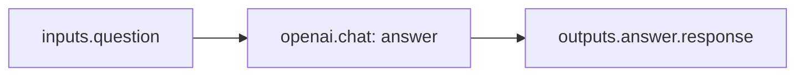
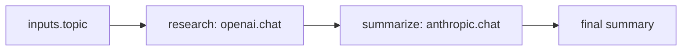
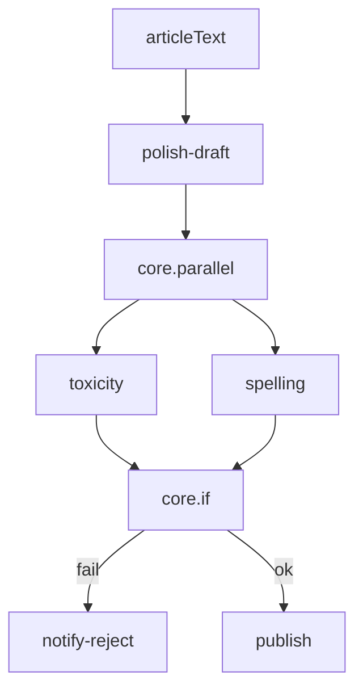
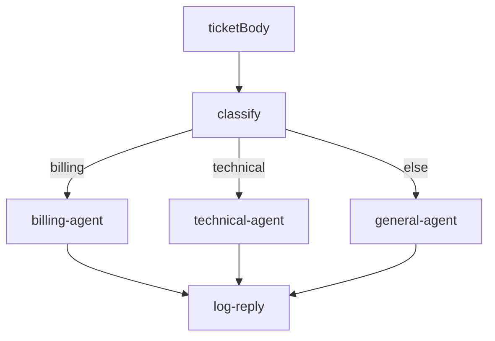
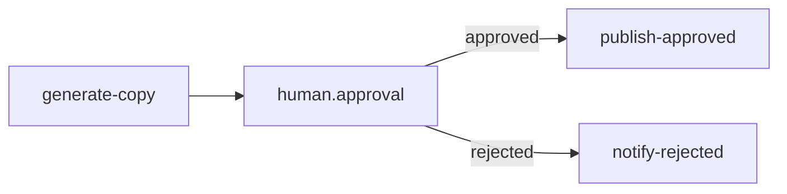
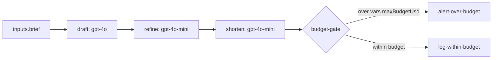

# 15 — Examples: What We Are Building

Before reading architecture or writing Java, skim these examples. They show **concrete workflows** OrchestrAI is designed to run: YAML in, multi-agent execution out, with observability and reliability built in.

Runnable files live in [`examples/`](../examples/). This page explains **what each one does**, **which features it exercises**, and **when to copy the pattern**.

---

## How to read an example

Every example file follows the same mental model:

| Piece | Role |
|-------|------|
| `id` + `namespace` | Identity and folder (like `production.marketing`) |
| `inputs` | Values passed when someone (or a webhook) starts a run |
| `variables` | Fixed config inside the flow (models, thresholds) |
| `tasks` | Ordered steps; each `type` is a plugin (`openai.chat`, `core.if`, …) |
| `{{ outputs.<taskId>... }}` | Wire one step's result into the next |
| `onFailure` | Optional cleanup when the run fails |

**Flow** = recipe (YAML file). **Execution** = one run of that recipe. **TaskRun** = one step inside that run. See [Terminology](./02-terminology.md).

---

## Example catalog

### 1. Hello Agent — start here

**File:** [`examples/01-hello-agent.yaml`](../examples/01-hello-agent.yaml)

The smallest useful flow: one input, one LLM task.



**Features:** inputs, variables, single plugin, expressions.

**Use when:** Validating the parser, worker, and OpenAI plugin end-to-end.

---

### 2. Research and Summarize — sequential chain

**File:** [`examples/02-research-and-summarize.yaml`](../examples/02-research-and-summarize.yaml)

Two agents in series: GPT researches, Claude summarizes. Different models per step are normal.



**Features:** multi-LLM pipeline, `outputs.*` chaining, cross-provider agents.

**Use when:** "Agent A → Agent B" is the core product story—connected agents, not isolated scripts.

---

### 3. Content Moderation — parallel + branch

**File:** [`examples/03-content-moderation.yaml`](../examples/03-content-moderation.yaml)

Polish text, run toxicity and spelling **in parallel**, then publish or alert based on results.



**Features:** `core.parallel`, nested outputs (`outputs.safety-checks.toxicity.*`), `core.if`, `onFailure`, HTTP side effects.

**Use when:** Latency matters—you can check multiple signals without waiting for each sequentially.

---

### 4. Support Ticket Router — classify then specialize

**File:** [`examples/04-support-ticket-router.yaml`](../examples/04-support-ticket-router.yaml)

One classifier task, then nested `core.if` branches so only the matching specialist agent runs.



**Features:** router pattern, conditional trees, CRM integration stub.

**Use when:** One ingress path (webhook/API) must fan out to different prompt specialists.

---

### 5. Model Fallback — resilience

**File:** [`examples/05-model-fallback.yaml`](../examples/05-model-fallback.yaml)

Primary extraction on OpenAI; on rate limit, timeout, or provider error, the engine runs the `fallback` task on Anthropic without rewriting the whole flow.

**Features:** `fallback`, `fallbackOn`, retries, timeouts.

**Use when:** Production flows cannot fail outright because one vendor blipped.

---

### 6. Human Approval — human-in-the-loop

**File:** [`examples/06-human-approval.yaml`](../examples/06-human-approval.yaml)

Generate copy → execution **pauses** at `human.approval` → publish only if approved (or notify on reject/timeout).



**Features:** `human.approval`, `if` on approval output, `PAUSED` execution state (see [AI Agents](./09-ai-agents.md)).

**Use when:** Legal, marketing, or compliance must sign off before side effects.

---

### 7. Shared Context — one conversation, two models

**File:** [`examples/07-shared-context.yaml`](../examples/07-shared-context.yaml)

Two tasks share `contextKey` so the second agent sees the first agent's conversation—not just a one-off string in `outputs`.

**Features:** shared memory within an execution, multi-model handoff.

**Use when:** Follow-up agents need thread history, not only the last message body.

**Note:** Long-term RAG still uses **your** vector DB via HTTP or custom plugins—not a built-in vector store. See [Vision — Out of Scope](./01-vision-and-goals.md#what-we-are-not-building-out-of-scope).

---

### 8. Cost Tracking — tokens and USD per step and per run

**File:** [`examples/08-cost-tracking.yaml`](../examples/08-cost-tracking.yaml)

Three LLM tasks in one flow (draft → refine → shorten). Each step automatically records token usage and estimated USD cost; the engine aggregates totals on the execution record.



**You do not configure cost tracking in YAML** — AI plugins return metrics on every TaskRun. Use YAML to:

| Mechanism | Purpose |
|-----------|---------|
| `labels` on the flow | Filter costs in `GET /metrics/costs` (team, cost-center, environment) |
| `variables.maxBudgetUsd` | Threshold for a post-run `core.if` budget gate |
| `{{ outputs.<taskId>.costUsd }}` | Branch or alert using a prior step's cost |
| `{{ outputs.<taskId>.tokensUsed }}` | Log or route based on token volume |
| `maxTokens` on a task | Cap completion size (indirect cost control) |

**Per-task output** (stored on `task_runs`, exposed as `outputs.<taskId>.*`):

See [`examples/sample-output/ai-task-run-output.json`](../examples/sample-output/ai-task-run-output.json).

```json
{
  "response": "...",
  "model": "gpt-4o",
  "tokensUsed": 1523,
  "promptTokens": 245,
  "completionTokens": 1278,
  "costUsd": 0.04569
}
```

**Per-execution rollup** (PostgreSQL `executions.total_cost_usd`, `total_tokens`; SSE `execution_completed`):

See [`examples/sample-output/execution-completed-sse.json`](../examples/sample-output/execution-completed-sse.json).

**Observability surfaces:**

| Surface | What you get |
|---------|----------------|
| Dashboard / TaskRun detail | Inputs, outputs, duration, `tokens_used`, `cost_usd` per task |
| `GET /executions/{id}` | Run summary including `totalCostUsd` |
| `GET /metrics/costs` | Breakdown by flow and by model |
| SSE `GET /executions/{id}/logs/stream` | `execution_completed` event with `totalCostUsd` |

**Features:** F3.3 token tracking, F3.4 cost calculation, F4.4 cost dashboard (P1), flow `labels` for attribution.

**Use when:** Finance or platform teams need per-flow LLM spend, or you want alerts when a single run exceeds a budget.

**Related:** [AI Agents — Cost & Token Tracking](./09-ai-agents.md#cost--token-tracking), [API — GET /metrics/costs](./10-api-design.md#get-metricscosts), [Data Models](./06-data-models.md).

---

## Map examples to MVP features

| Example | MVP weeks (see [Roadmap](./13-roadmap.md)) | Related docs |
|---------|---------------------------------------------|--------------|
| 01 Hello Agent | 3–4 execution, 7 LLM plugins | [YAML Schema](./04-yaml-schema.md), [AI Agents](./09-ai-agents.md) |
| 02 Research & Summarize | 3–4, 7 | [Features F3.1](./03-features.md), [Plugin System](./08-plugin-system.md) |
| 03 Content Moderation | 3–4 control flow, 8 HTTP | [Execution Engine](./07-execution-engine.md) |
| 04 Ticket Router | 3–4 | [Terminology — Chain](./02-terminology.md) |
| 05 Model Fallback | 3–4 retries, P1 fallback | [AI Agents — Fallback](./09-ai-agents.md) |
| 06 Human Approval | P2 HITL | [AI Agents — HITL](./09-ai-agents.md) |
| 07 Shared Context | P2 shared memory | [AI Agents — Context](./09-ai-agents.md) |
| 08 Cost Tracking | 7–8 LLM plugins, P1 metrics | [AI Agents — Cost](./09-ai-agents.md), [API metrics](./10-api-design.md) |

Examples **06**, **07**, and **08** highlight P1/P2 capabilities (HITL, shared memory, cost metrics); **01–05** align with the core P0 MVP path. Cost **rollup is automatic** for every AI task once plugins are implemented—example **08** shows how to *use* those numbers in flows and ops.

---

## Suggested reading order for new developers

1. [00 — Overview](./00-overview.md) — problem and value prop  
2. [02 — Terminology](./02-terminology.md) — Flow, Execution, TaskRun  
3. **This page** + open `examples/01` and `examples/02` in the editor  
4. [04 — YAML Schema](./04-yaml-schema.md) — full field reference  
5. [05 — Architecture](./05-architecture.md) — how it runs under the hood  

---

## Contributing examples

When adding a new example:

1. Add `examples/NN-short-name.yaml` with a comment block at the top explaining intent.  
2. Register it in [`examples/README.md`](../examples/README.md).  
3. Add a short section to this document with a diagram and feature list.  
4. Prefer realistic `namespace` values (`examples.*`, `production.*`) and fake URLs (`https://api.example.com`)—never real secrets.
