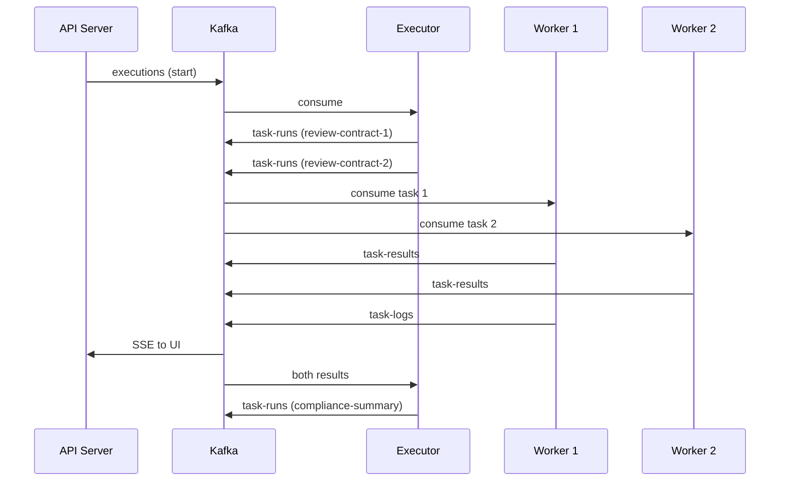

# Distributed execution — Kafka & multi-worker scaling

OrchestrAI runs flows **without** embedding orchestration logic in your app. Distribution is a **platform property**: the same YAML runs on one laptop or across ten workers.

Full architecture: [docs/05-architecture.md](../docs/05-architecture.md). Example flow: [`16-distributed-document-review.yaml`](./16-distributed-document-review.yaml).

---

## What “distributed” means here

| Layer | Stateful? | Role |
|-------|-----------|------|
| **API Server** | DB for metadata | Accept execute, stream SSE |
| **Executor** | DB only (locks) | State machine, dispatch next tasks |
| **Worker** | **Stateless** | Run one plugin, emit result |
| **Kafka** | Durable log | Queue between components |

Workers **never** see the full flow graph. They receive a single `TaskRun` payload, execute `Plugin.execute()`, and publish to `task-results` + `task-logs`.

---

## Kafka topics (one execution)



| Topic | Payload | Producer → Consumer |
|-------|---------|-------------------|
| `executions` | Start / resume | API, Scheduler → Executor |
| `task-runs` | Work unit | Executor → **Worker pool** |
| `task-results` | Output + metrics | Worker → Executor |
| `task-logs` | Structured logs | Worker → API (SSE + DB buffer) |
| `dead-letter` | Failed after retries | Worker → Ops |

Sample worker payload: [`sample-output/kafka-task-run-message.json`](./sample-output/kafka-task-run-message.json).

---

## Which YAML patterns scale across workers?

| Pattern | Distributed behavior | Example |
|---------|----------------------|---------|
| **`core.parallel`** | Executor publishes **N** `task-runs` at once; workers process concurrently | `16`, `03`, `10` |
| **`core.foreach`** | One `task-runs` per iteration (platform may run iterations concurrently) | `15` |
| **Many executions** | Each API trigger is independent; workers share the pool | Cron `11`, webhook `04` |
| **Sequential tasks** | One worker at a time per execution path | `02` |
| **Executor-only** | `core.if` / routing — no worker | Evaluated in Executor |

Example **16** uses `core.parallel` so four `openai.chat` reviews can land on four different workers. The final `compliance-summary` runs only after **all** parallel results arrive on `task-results`.

---

## Scale workers (ops)

**Docker Compose** ([docs/11-deployment.md](../docs/11-deployment.md)):

```yaml
orchestrai-worker:
  deploy:
    replicas: 3   # increase for more throughput
```

**Kubernetes:** `orchestrai-worker` Deployment `replicas: 3`.

**Not in flow YAML:** replica count is infrastructure. Flows stay identical when you add workers.

---

## Throughput vs single execution

| Knob | Effect |
|------|--------|
| More **worker replicas** | Faster **parallel** branches and more concurrent **executions** |
| Kafka **partitions** on `task-runs` | Upper bound on parallel consumers per topic |
| Provider **rate limits** | Often the real cap for LLM-heavy flows |
| `maxToolRounds` / timeouts | Per-task limits (unchanged by worker count) |

---

## Kafka event trigger (starts a new execution)

**Primary example:** [`17-order-fulfillment-kafka-trigger.yaml`](./17-order-fulfillment-kafka-trigger.yaml) — `ecommerce.orders.created` → validate → LLM packing note → WMS.

| Concept | Internal Kafka (`task-runs`) | **Trigger Kafka** (`type: kafka`) |
|---------|---------------------------|-----------------------------------|
| Purpose | Run the next task in a flow | **Start** a new flow |
| Topic | Platform-owned | **Your** business topic |
| Consumer | Worker pool | OrchestrAI trigger service |
| Frequency | Many per execution | One execution per message |

Sample inbound record: [`kafka-trigger-message.json`](./sample-output/kafka-trigger-message.json).

---

## Goals alignment

| Goal | How distribution helps |
|------|-------------------------|
| **G5 Performance** | Parallel tasks + worker pool |
| **G2 Reliability** | Worker crash → another consumer redelivers `task-runs` |
| **G6 Agent logic** | YAML unchanged; ops scales replicas |

---

## Related examples

| File | Distributed angle |
|------|-------------------|
| [`16-distributed-document-review.yaml`](./16-distributed-document-review.yaml) | **Primary demo** — parallel LLM reviews |
| [`03-content-moderation.yaml`](./03-content-moderation.yaml) | Parallel moderation + policy |
| [`10-incident-triage.yaml`](./10-incident-triage.yaml) | Parallel runbook + draft comms |
| [`15-churn-outreach-foreach.yaml`](./15-churn-outreach-foreach.yaml) | Batch loop → many task-runs |
